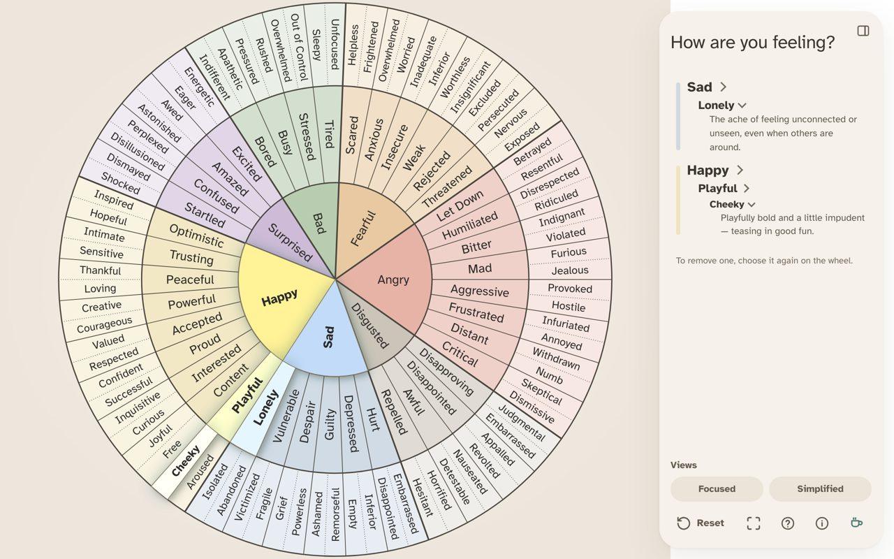
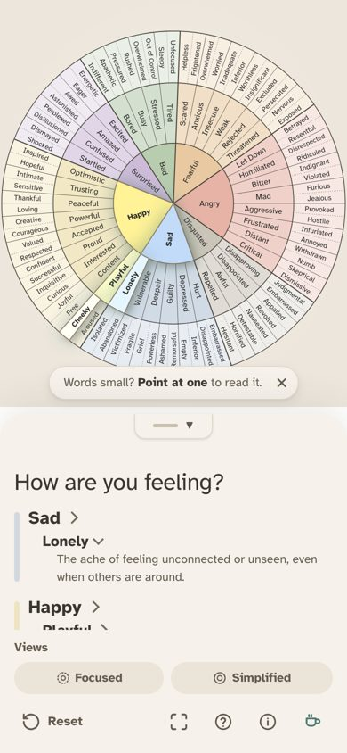
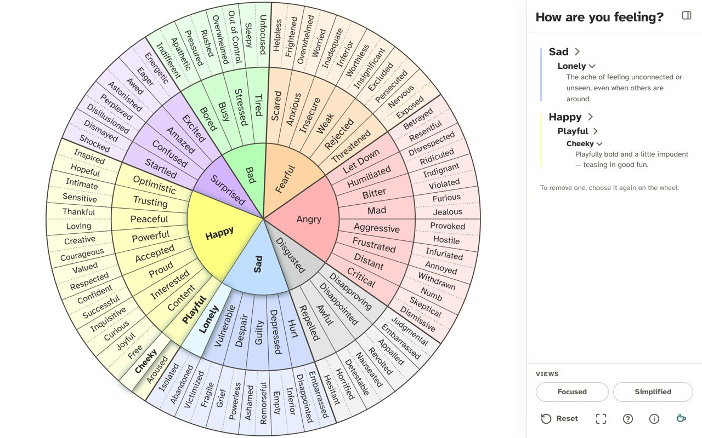
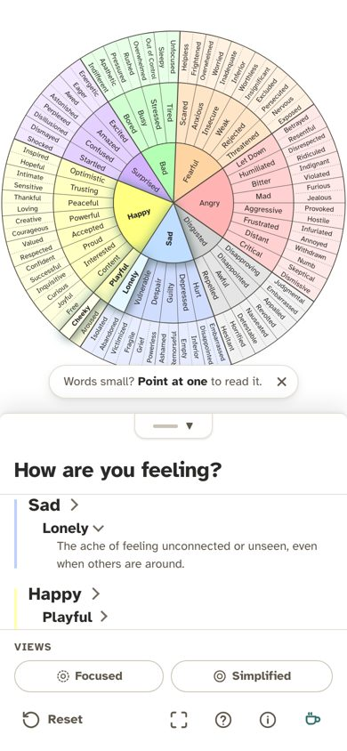
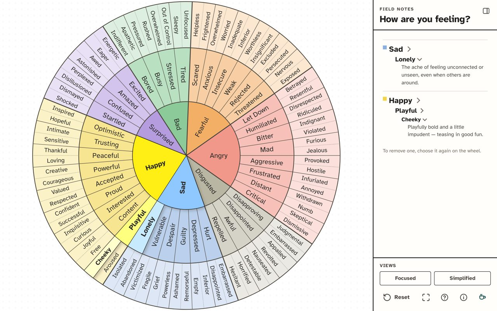
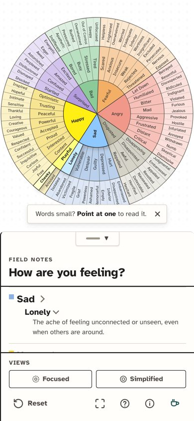

# Design directions

On 2026-10-05 three North Stars were rendered on the real app (same words, definitions, font and chosen feelings) and compared. **The Quiet Room** was chosen and is the live system, specified in [`DESIGN.md`](../DESIGN.md). The two alternatives below are kept so we can return to them. Each lists everything needed to rebuild it: the tokens in `styles.css`, the family colours in `feelings-data.ts`, and the component changes.

Product rules hold in every direction: the feeling words and definitions are fixed, the font is Atkinson Hyperlegible, the UI never interprets feelings, and every text pair must meet WCAG AA.

## The Quiet Room (chosen)

| Desktop | Phone |
| --- | --- |
|  |  |

The mockup floated the panel as a rounded card. The owner kept the style but asked for the panel to dock to the edge like the others, and that is what shipped.

## The Shared Map (previous system, back pocket)

**North Star:** a calm, faithful map that therapist and client read together. The interface hands it over and steps back. Colour belongs to the wheel; the chrome is paper, ink and one teal.

| Desktop | Phone |
| --- | --- |
|  |  |

**Character:** bright pastel wheel, crisp white panel, hairline edges, bold headline. Clear and familiar, but the bright pastels read busier and the white panel is the brightest thing on screen.

**Tokens (`:root` in `styles.css`):**

| Token | Value |
| --- | --- |
| `--color-bg` | `#f7f4ef` (warm paper) |
| `--color-surface` | `#ffffff` |
| `--color-surface-alt` | `#f2eee7` |
| `--color-ink` / `-muted` / `-faint` | `#2b2a28` / `#5e574c` / `#736b5e` |
| `--color-border` / `-strong` | `#e4ded4` / `#cbc3b6` |
| `--color-accent` / `-text` / `-strong` | `#2f6f6e` / `#1f4e4d` / `#245957` |
| `--color-focus` | `#1b4d4c` |
| `--wheel-line`, `--wheel-ring` | `#4a453d` |
| `--wheel-selected-glow` | `drop-shadow(0 0 6px rgba(47, 111, 110, 0.55))` |

**Family colours (`feelings-data.ts`):** Angry `#FFB3B3`, Disgusted `#D3D3D3`, Sad `#B3C6FF`, Happy `#FFFF99`, Surprised `#D4B3FF`, Bad `#B3FFB3`, Fearful `#FFD4A3`.

**Components:**

- The panel is white, with a 1px hairline left edge and a `-8px 0 24px rgba(43,42,40,0.04)` shadow. On phones the bottom sheet has 18px top corners and a hairline top.
- Headline: 700 weight, 1.5rem. Header and footer are separated by 1px hairlines.
- View chips: white pills outlined in `--color-border-strong`. The "Views" label is 0.75rem uppercase with 0.06em tracking.
- Selected wedge: `saturate(1.4) brightness(1.12)`. Hover: `saturate(1.2) brightness(1.1)`.

To revive it, check out `styles.css` and `feelings-data.ts` from commit `f23758f` (the last commit before Quiet Room), and restore `DESIGN.md` and `.impeccable/design.json` from the same commit.

## The Field Guide (back pocket)

**North Star:** a precise, trustworthy reference to the landscape of feelings, like a well-made printed field guide. It names things without interpreting them.

| Desktop | Phone |
| --- | --- |
|  |  |

**Character:** crisp near-white paper, strong ink rules, square corners, ruled sections, clearer printed-ink family colours, and a faint dotted-paper grid behind the wheel. Confident and well made, but more "reference book" than "calm room".

**Tokens:**

| Token | Value |
| --- | --- |
| `--color-bg` | `#fbfaf6` |
| `--color-surface` | `#fffefb` |
| `--color-surface-alt` | `#f1efe8` |
| `--color-ink` / `-muted` | `#1f1e1c` / `#4b4740` |
| `--color-border` / `-strong` | `#d9d4c8` / `#9d978a` |
| `--color-accent` / `-text`, `--color-focus` | `#17504e` / `#103c3a` |
| `--wheel-line`, `--wheel-ring` | `#1f1e1c` |
| Radii `sm` / `md` / `lg` / `pill` | `3px` / `4px` / `6px` / `4px` |
| `--wheel-selected-glow` | none (selection carried by colour and bold label) |

**Family colours:** Angry `#F2988B`, Disgusted `#B9B6A3`, Sad `#8CB0E0`, Happy `#F4D449`, Surprised `#B49CDF`, Bad `#8CCB99`, Fearful `#F4AF67`.

**Components:**

- Panel: a 2px ink rule on the left, no shadow. The header and footer are separated by 2px ink rules.
- Each family in the chosen list sits under a 1px rule. A 10px square swatch replaces the family stem.
- View chips: square-cornered (4px) and outlined in ink.
- Wheel background: `radial-gradient(circle, #00000010 1px, transparent 1px)` at a 16px grid.
- The mockup put a small-caps "Field notes" label above the heading. That is placeholder copy and an eyebrow label, which the design rules ban, so don't ship it.

**Before shipping:** re-run the contrast audit (ink on the stronger family colours, and white on `#17504e`), and confirm the dotted grid doesn't fight the outer-ring words on small screens.
